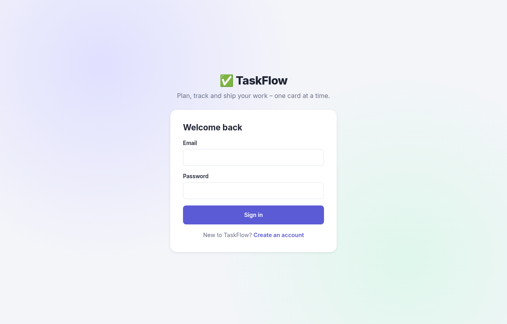
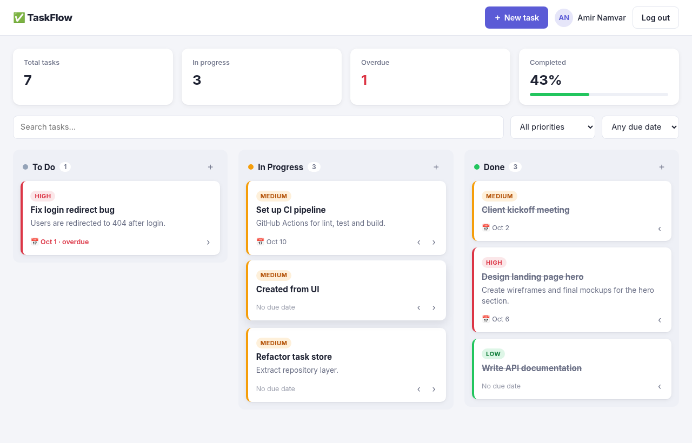
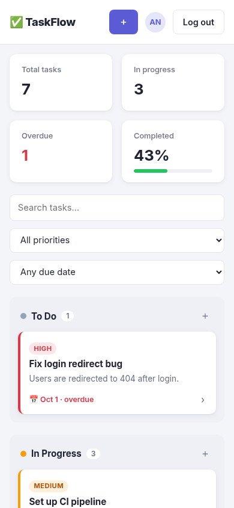

# ✅ TaskFlow

A Kanban-style task management dashboard with a **React (Vite)** frontend and a **Node.js + Express** REST API secured with **JWT authentication**. Create, organise and track tasks across *To Do*, *In Progress* and *Done* columns with priorities, due dates, filters and live statistics.

> Portfolio project by **Amir Namvar** – full-stack web developer.

---

## ✨ Features

- **Authentication** – register and log in with email + password (bcrypt-hashed), stateless JWT sessions, automatic session restore.
- **Kanban board** – three columns with native **drag & drop**, plus arrow buttons for keyboard and touch users.
- **Full task CRUD** – title, description, status, priority (low / medium / high) and due date, edited in an accessible modal dialog.
- **Optimistic UI** – cards move instantly and roll back if the API call fails.
- **Filters** – instant search, priority filter and due-date filter (overdue, next 7 days, no date).
- **Dashboard stats** – total, in-progress and overdue counts plus a completion progress bar.
- **Overdue highlighting** and friendly due-date labels ("Today", "Tomorrow", …).
- **Responsive** – works from large desktop screens down to mobile.
- **Clean API** – per-user data isolation, input validation with field-level errors, consistent JSON error responses.
- **Zero native dependencies** – data is stored in a JSON file with atomic writes, so it runs anywhere Node runs.
- **Tests** – API integration tests with Node's built-in test runner.

## 🛠 Tech Stack

| Layer    | Technology |
|----------|------------|
| Frontend | React 19, Vite 7, Context API, plain CSS (custom properties) |
| Backend  | Node.js 20+, Express 5, jsonwebtoken, bcryptjs, cors, dotenv |
| Storage  | JSON file store (`server/data/db.json`) behind a small repository module |
| Testing  | `node:test` + native `fetch` |

## 📸 Screenshots

> _Screenshots live in `docs/screenshots/` – replace them with your own as the project evolves._

| Login | Board | Mobile |
|-------|-------|--------|
|  |  |  |

## 🚀 Getting Started

### Prerequisites

- **Node.js** 20.19+ (or 22.12+) and npm

### 1. Clone the repository

```bash
git clone https://github.com/som-info/taskflow.git
cd taskflow
```

### 2. Start the API

```bash
cd server
npm install
cp .env.example .env      # then set a strong JWT_SECRET
npm run dev               # http://localhost:4000 (auto-restarts on changes)
```

Run the API tests:

```bash
npm test
```

### 3. Start the frontend

In a second terminal:

```bash
cd client
npm install
npm run dev               # http://localhost:5173
```

During development, Vite proxies `/api` requests to `http://localhost:4000`. Open the app, create an account and start adding tasks.

Production build:

```bash
npm run build             # outputs to client/dist
```

If the API is hosted elsewhere, copy `client/.env.example` to `client/.env` and set `VITE_API_URL`.

### Environment variables (server)

| Variable         | Default                 | Description |
|------------------|-------------------------|-------------|
| `PORT`           | `4000`                  | API port |
| `JWT_SECRET`     | random per run (dev)    | Secret used to sign tokens. **Required when `NODE_ENV=production`.** |
| `JWT_EXPIRES_IN` | `7d`                    | Token lifetime |
| `DATA_FILE`      | `data/db.json`          | Path of the JSON data file |
| `CLIENT_ORIGIN`  | `http://localhost:5173` | Allowed CORS origin(s), comma-separated |

## 🔌 API Reference

All task routes require an `Authorization: Bearer <token>` header.

| Method | Endpoint             | Description |
|--------|----------------------|-------------|
| GET    | `/api/health`        | Health check |
| POST   | `/api/auth/register` | `{ name, email, password }` → `{ token, user }` |
| POST   | `/api/auth/login`    | `{ email, password }` → `{ token, user }` |
| GET    | `/api/auth/me`       | Current user |
| GET    | `/api/tasks`         | List tasks. Optional query: `status`, `priority`, `search` |
| GET    | `/api/tasks/:id`     | Get a task |
| POST   | `/api/tasks`         | Create a task |
| PATCH  | `/api/tasks/:id`     | Update some fields (e.g. `{ "status": "done" }`) |
| PUT    | `/api/tasks/:id`     | Replace all editable fields |
| DELETE | `/api/tasks/:id`     | Delete a task |

Task shape:

```json
{
  "id": 1,
  "title": "Set up CI pipeline",
  "description": "GitHub Actions for lint, test and build.",
  "status": "in-progress",
  "priority": "medium",
  "dueDate": "2026-10-10",
  "createdAt": "2026-10-04T15:26:24.536Z",
  "updatedAt": "2026-10-04T15:26:24.536Z"
}
```

Validation errors return `400` with field details:

```json
{ "error": "Validation failed.", "details": { "title": "Title is required." } }
```

## 📁 Project Structure

```
taskflow/
├── client/                     # React frontend
│   ├── src/
│   │   ├── api/client.js       # fetch wrapper with JWT handling
│   │   ├── components/         # Board, TaskCard, TaskModal, Filters, Stats, Header
│   │   ├── context/AuthContext.jsx
│   │   ├── pages/              # AuthPage, DashboardPage
│   │   ├── constants.js        # columns, priorities, date helpers
│   │   ├── App.jsx
│   │   ├── index.css
│   │   └── main.jsx
│   ├── index.html
│   ├── package.json
│   └── vite.config.js
├── server/                     # Express API
│   ├── src/
│   │   ├── middleware/         # JWT auth, error handling
│   │   ├── routes/             # auth.js, tasks.js
│   │   ├── utils/              # validation, HttpError
│   │   ├── app.js              # Express app factory
│   │   ├── config.js           # environment configuration
│   │   ├── store.js            # JSON file data store
│   │   └── index.js            # entry point
│   ├── tests/api.test.js
│   ├── data/                   # runtime data (git-ignored)
│   ├── .env.example
│   └── package.json
├── docs/screenshots/
├── LICENSE
└── README.md
```

## 🗺 Possible Improvements

- Swap the JSON store for PostgreSQL or SQLite (only `store.js` needs to change)
- Task ordering within a column, labels and comments
- Refresh tokens / httpOnly cookie sessions
- Team workspaces and task assignment

## 📄 License

This project is licensed under the [MIT License](LICENSE).

---

Made with ❤️ by [Amir Namvar](https://github.com/som-info)
